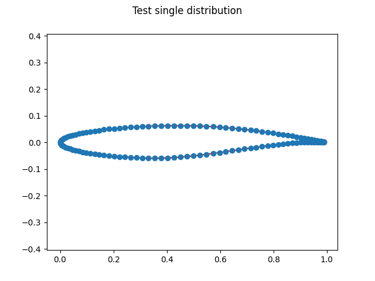
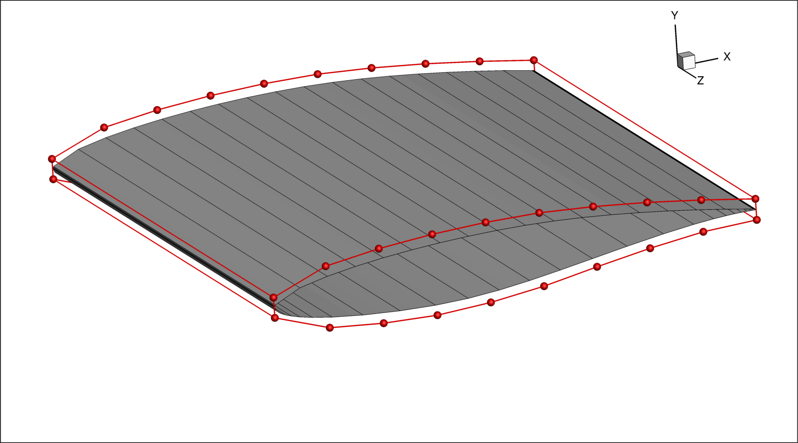

.. _examples:

Examples
========
This page serves as a short demonstration for some of the capabilities for pyFoil.
The examples presented on this page can be found in ``examples/example_script.py`` of the pyFoil repository.

Import Libraries
----------------
.. literalinclude:: ../examples/example_script.py
   :start-after: # rst IMPORTS start
   :end-before: # rst IMPORTS end

These are the typical imports for using pyFoil.
:class:`Airfoil` and :meth:`readCoordFile` are always needed to use pyFoil.
``sampling`` gives access some :ref:`sampling functions <sampling_API>` that can be used to create surface meshes.
``matplotlib`` is imported to enable visualizing airfoils through built in plotting tools, however this is not necessary for scripts that generate surface meshes.

Plotting an Airfoil
-------------------
.. literalinclude:: ../examples/example_script.py
   :start-after: # rst PLOT start
   :end-before: # rst PLOT end

pyFoil performs most of its functionality through the use of the :class:`Airfoil` class.
The :meth:`readCoordFile` returns a set of coordinates that can be used to initialize the :class:`Airfoil`.
Then the airfoil can be visualized by calling :meth:`plot`, which returns a ``matplotlib.pyplot.Figure`` object.
The resulting plot is shown below.

Sampling an Airfoil
-------------------
Typically, when performing computational analysis on airfoil, constant point spacing along the chord of the airfoil is wasteful.
The leading and trailing edges of an airfoil have flow features defined by a much smaller length scale than the flow features near the mid-chord. 
A uniform grid fine enough to capture the flow features at the leading and trailing edges would use more points than necessary near the mid-chord, wasting computational resources.
Grids can be generated with less cells that retain the same level of accuracy, by putting smaller cells near the ends of the airfoil and larger cells in the middle.
Here, sampling an airfoil refers to the definition of points along the surface that make up the cells in this non-uniform fashion.

.. literalinclude:: ../examples/example_script.py
   :start-after: # rst COMPSAMPLE start
   :end-before: # rst COMPSAMPLE end

This block of codes plots two different point samplings along an airfoil.
After sampling an airfoil, the :meth:`plot` function shows the most recently sampled points rather than the original.

.. note:: Sampling points does not change the underlying spline in the :class:`pyfoil.pyFoil.Airfoil`. That is only changed by :meth:`pyfoil.pyFoil.Airfoil.removeTE` or any of the geometry modification functions (:meth:`pyfoil.pyFoil.Airfoil.scale`, :meth:`pyfoil.pyFoil.Airfoil.rotate`, etc.).

Both sets of sampled points containing 50 points.
When using the :meth:`conical` sampling function, higher coefficents result in more nodes being clustered near the ends of the airfoil.

.. literalinclude:: ../examples/example_script.py
   :start-after: # rst ULSAMPLING start
   :end-before: # rst ULSAMPLING end

This shows a method for defining the sampling of both the upper and lower surfaces of the airfoil.
If a list containing two functions is passed into :meth:`getSampledPts` then the first item defines the upper surface sampling function and the second item defines the lower surface sampling function.

Setting up an Optimization
--------------------------
.. literalinclude:: ../examples/example_script.py
   :start-after: # rst OPTSETUP start
   :end-before: # rst OPTSETUP end

pyFoil serves two purposes when setting up an airfoil optimization. 
The first is to generate the ``plot3d`` surface mesh.
It may seem counterintuitive to set up a 3D mesh for a 2D airfoil, but :doc:`Adflow <adflow:index>` (the Mach-Aero CFD solver used in airfoil optimizations) uses one cell wide 3D meshes to compute 2D cases.
After generating the surface mesh a fitted FFD is generated to preform an optimization using :meth:`pyfoil.pyFoil.Airfoil.generateFFD`.

In this image, the one cell wide surface mesh can be seen on the airfoil surrounded by the FFD box highlighted in red.
From here, an optimization can be preformed starting with :ref:`pyHyp <airfoilopt_mesh>`
